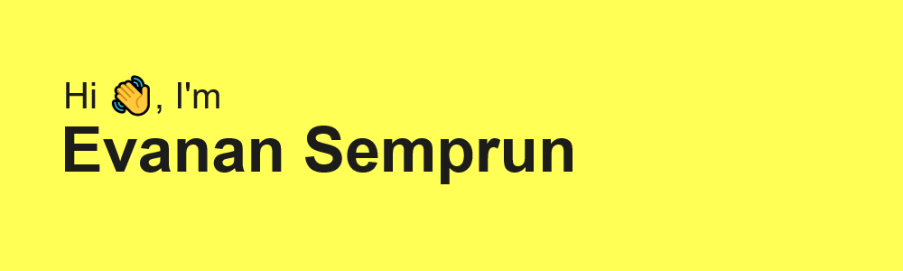

##  About Me:

💻ingeniero en computación en proceso de transformarse en desarrollador full stack  
💻computer engineer in the process of becoming a full stack developer 

  

<h3 align="left">Languages and Tools:</h3>

    
    
    
    
    
    
    
    

